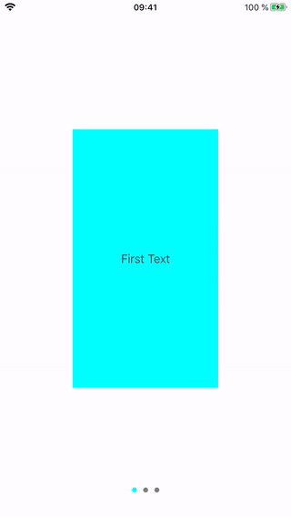

# WalkThrough demo
This is the simplest example to show UIScrollView with PageControl and some anumation.
I hope it is the easiest way to show ScrollView. You can use it for Splash screen, Intro screen, WalkThrough screen, Demo screen, Instruction screen 

* UIScrollView
* UIPageControll
* custom UIView
* animation with scrolling
* all setup via code
